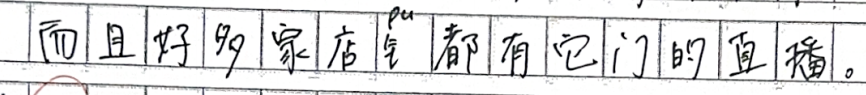

# VisCGEC: Benchmarking the Visual Chinese Grammatical Error Correction


VisCGEC is an innovative benchmark dataset for visual Chinese grammatical error correction, comprising 2,451 images sourced from real-world handwritten texts by Chinese-as-a-Foreign-Language (CFL) learners. As the first dataset of its kind, VisCGEC integrates both textual and visual modalities, capturing the authentic challenges CFL learners face, including phonological and visual errors commonly made when writing Chinese characters.


## Dataset Overview
Each image in the dataset is annotated with:
- Recognized texts (with errors).
- Corrected texts (grammatically correct).

The dataset is organized as follows:
```
|-- dataset
   | -- Visual_image      # contains sentence-level images
      | -- train
      | -- test
      | -- valid
      
   | -- Visual_OCR         # source_text is obtained by BaiduOCR
      | -- trainset.json
      | -- validset.json
      | -- testset.json 
      
   | -- Visual_text        # source_text is obtained by Manual Recognition
      | -- trainset.json
      | -- validset.json
      | -- testset.json 
      
   | -- Visual_YOLO_CLIP   # source_text is obtained by YOLO_CLIP
      | -- trainset.json
      | -- validset.json
      | -- testset.json 
```

Here is an example image `Visual_image/train/933_2.png` :



Each entry in the JSON file `Visual_OCR/trainset.json` contains:
```json
    {
        "id": 309,
        "img_id": "933_2",
        "source_text": "而且好多家店都有它门的直播。",
        "target_text": "而且好多家店铺都有它们的直播。",
        "source_ground_truth": "而且好多家店X都有它门的直播。"
    }
```

* `id`: A unique identifier for the sentence.
* `img_id`: The identifier of the corresponding image (matches the image filename).
* `source_text`: Error text in the image obtained by **BaiduOCR/YOLO_CLIP**.
* `target_text`: The corrected version of the source text.
* `source_ground_truth`: Error text in the image obtained by **Manual Recognition**（fake characters replaced by "X"）

```py
Note: The files in `Visual_text/XXXset.json` only contain `source_text` and `target_text`.  
The `source_text` is identical to the `source_ground_truth` field in `Visual_OCR/XXXset.json` and `Visual_YOLO_CLIP/XXXset.json`.
```

## Dataset Statistics

| Property            | Train | Dev  | Test |
|---------------------|-------|------|------|
| # Images           | 1960  | 245  | 246  |
| Avg. Source Length | 24.27 | 25.00 | 23.18 |
| Avg. Target Length | 24.57 | 25.52 | 23.67 |
| # Edits per Sentence | 1.78  | 1.78 | 1.84 |


## Baseline Approaches
We propose two baseline frameworks for the VisCGEC task:

### Two-Stage Pipeline:

#### *Stage 1 : Recognition*
- Uses [BaiduOCR](https://cloud.baidu.com/doc/OCR/s/tk3h7y2aq) or [CLIP-based](https://github.com/OFA-Sys/Chinese-CLIP) methods to recognize characters from handwritten images. 

#### *Stage 2 : Correction*
- Applies Seq2Seq([SynGEC](https://github.com/HillZhang1999/SynGEC)), Seq2Edit([GECToR](https://aclanthology.org/2020.bea-1.16/)), or fine-tuned LLMs ([Qwen](https://huggingface.co/Qwen/Qwen2-7B-Instruct/tree/main)) to correct grammatical errors.

### End-to-End System:
- Utilizes Multimodal Large Language Models (MLLMs) like [GPT-4o](https://openai.com/index/hello-gpt-4o/) to directly correct errors in handwritten images.


## Getting Started
### Installation
We use Python 3.8 in our experiments. Please install allennlp 1.3.0 first, then install other dependencies:
```shell
pip install allennlp==1.3.0
pip install -r requirements.txt
```

Note: Errors may occur while installing jsonnet with `pip`. Users are suggested to use `conda install jsonnet` to finish installation.

### Usage
Please create directories for logs and checkpoints before using our framework:
```shell
mkdir log
mkdir checkpoint
```
### Run

```shell
CUDA_VISIBLE_DEVICES=6 python run.py --method XX --correction-model XXX
```

| Parameters         | Instruction                  | Option                     | Default   |
|--------------------|------------------------------|----------------------------|-----------|
| --dataset          | Name of datasets             | Visual                     | Visual    |
| --method           | Choose the method            | OCR, YOLO_CLIP, GPT4v,text | YOLO_CLIP |
| --correction-model | Choose the correction model  | SynGEC, GECToR, qianwen    | qianwen   |
| --augment          | Use data augmentation or not | none, noise, translation   | None      |


## Evaluation
ChERRANT : https://github.com/HillZhang1999/MuCGEC

Usage is referenced from official repository:
```shell
cd gectoolkit/evaluate/cherrant
python parallel_to_m2.py -f ../hyp.txt -o hyp.m2 -g char
python compare_m2_for_evaluation.py -hyp hyp.m2 -ref ref.m2
```


## Experiment Results
<table>
  <thead>
    <tr>
      <th>Recog.</th>
      <th>Correct.</th>
      <th colspan="3">Detection<br>Character-Level</th>
      <th colspan="3">Correction<br>Character-Level</th>
      <th colspan="3">Detection<br>Sentence-Level</th>
      <th colspan="3">Correction<br>Sentence-Level</th>
    </tr>
    <tr>
      <th></th>
      <th></th>
      <th>Prec.</th><th>Rec.</th><th>F0.5</th>
      <th>Prec.</th><th>Rec.</th><th>F0.5</th>
      <th>Prec.</th><th>Rec.</th><th>F0.5</th>
      <th>Prec.</th><th>Rec.</th><th>F0.5</th>
    </tr>
  </thead>
  <tbody>
    <tr><td colspan="14" style="text-align:center;"><b>Two-stage Pipeline</b></td></tr>
    <tr>
      <td rowspan="3">OCR</td>
      <td>GECToR</td>
      <td>45.64</td><td>38.31</td><td>43.96</td>
      <td>10.23</td><td>6.80</td><td>9.29</td>
      <td>15.65</td><td>19.17</td><td>16.24</td>
      <td>4.47</td><td>4.47</td><td>4.47</td>
    </tr>
    <tr>
      <td>SynGEC</td>
      <td>66.98</td><td>69.15</td><td>67.41</td>
      <td>21.98</td><td>26.32</td><td>22.73</td>
      <td>28.92</td><td>58.42</td><td>32.17</td>
      <td>11.38</td><td>11.38</td><td>11.38</td>
    </tr>
    <tr>
      <td>Qwen</td>
      <td>57.85</td><td>39.43</td><td>52.91</td>
      <td>30.43</td><td>23.03</td><td>28.59</td>
      <td><b>32.95</b></td><td>45.31</td><td><b>34.85</b></td>
      <td><b>15.85</b></td><td><b>15.85</b></td><td><b>15.85</b></td>
    </tr>
 <!-- CLIP Multirow -->
    <tr>
      <td rowspan="3">CLIP</td>
      <td>GECToR</td>
      <td>69.92</td><td>62.42</td><td>68.28</td>
      <td>26.63</td><td>22.40</td><td>25.66</td>
      <td>10.92</td><td>20.88</td><td>12.07</td>
      <td>3.66</td><td>3.66</td><td>3.66</td>
    </tr>
    <tr>
      <td>SynGEC</td>
      <td><b>77.98</b></td><td><b>81.58</b></td><td><b>78.67</b></td>
      <td>31.83</td><td><b>36.28</b></td><td><b>32.63</b></td>
      <td>23.47</td><td><b>60.98</b></td><td>26.77</td>
      <td>6.10</td><td>6.10</td><td>6.10</td>
    </tr>
    <tr>
      <td>Qwen</td>
      <td>71.49</td><td>65.25</td><td>70.15</td>
      <td><b>32.39</b></td><td>28.11</td><td>31.43</td>
      <td>21.22</td><td>36.19</td><td>23.14</td>
      <td>6.10</td><td>6.10</td><td>6.10</td>
    </tr>
    <tr><td colspan="14" style="text-align:center;"><b>End-to-end multi-modal LLMs</b></td></tr> <tr>
      <td></td><td>GPT-4</td>
      <td>51.76</td><td>16.69</td><td>36.45</td>
      <td>14.35</td><td>6.86</td><td>11.78</td>
      <td>4.60</td><td>7.07</td><td>4.95</td>
      <td>2.85</td><td>2.85</td><td>2.85</td>
    </tr>
  </tbody>
</table>

## Related works
- [UnifiedGEC](https://github.com/AnKate/UnifiedGEC): Unified Grammatical Error Correction Framework
- [Chinese CLIP](https://github.com/OFA-Sys/Chinese-CLIP) : Text-Image classification (image to text)
- [LLaMA-Factory](https://github.com/hiyouga/LLaMA-Factory): Fine-Tuning LLM (Qwen,Llama)
- [飞书文档VisCGEC](https://mqy6848ccmz.feishu.cn/docx/PTHQdvJP8o4da2xLyumcrTVHnHd?from=from_copylink): Detailed explanation of viscgec code


## Contact
If you have any problems, feel free to contact me at [xmwang@stu.ecnu.edu.cn](xmwang@stu.ecnu.edu.cn).